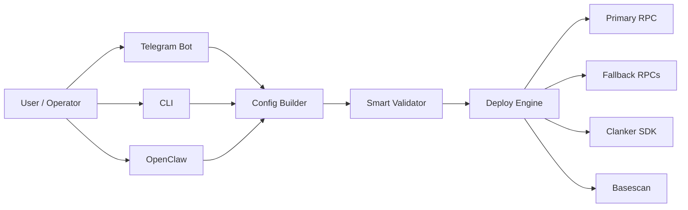

# Clank & Claw v2.7.0

Production-grade token deployment suite for Base using Clanker SDK.

Deploy from:
- Telegram bot (`telegram-bot.js`)
- CLI (`deploy.js`)
- OpenClaw handler (`openclaw-handler.js`)

All paths use one shared smart validation pipeline so deployment can continue even when user input is incomplete.

## Why This System

- Smart auto-heal for messy input (fees/context/image/social/rewards)
- RPC + gateway failover for unstable VPS/network conditions
- Consistent preflight output before on-chain execution
- Session-safe Telegram workflow for multi-user operation

## Visual Overview



Detailed system documentation and sequence diagrams: `docs/SYSTEM_ARCHITECTURE.md`

## Smart Logic (Default ON)

`SMART_VALIDATION=true` enables auto-heal behavior:

- High fees (e.g. `20%`) are auto-capped to protocol-safe max (`6%` total) for bot/env flows
- Missing image gets fallback from `DEFAULT_IMAGE_URL` (or default CID gateway)
- Missing context gets fallback from `DEFAULT_CONTEXT_ID`; if absent, synthetic context is generated
- Context platform/messageId can be auto-derived from any provided source URL
- Invalid social links are normalized or dropped
- Invalid reward split is rebalanced to `10000 bps`
- Invalid strict-mode input is auto-relaxed to standard mode (deploy continues)

`token.json` can opt out per file with `advanced.smartValidation: false` (strict mode, no auto-correct).
`token.json` also supports explicit fee mode config (`fees.mode = static|dynamic`) and does not enforce a hard fee cap in validator.

Preflight now shows how many smart fixes were applied.

## Quick Start

### 1) Install

```bash
git clone https://github.com/Timcuan/clank-and-claw.git
cd clank-and-claw
npm install
```

### 2) Configure

```bash
cp .env.vps.example .env
npm run setup
```

### 3) Run

Telegram bot:
```bash
npm run start
```

CLI (from `token.json`):
```bash
npm run deploy
```

Dry-run test:
```bash
npm test
```

Hardening test suite:
```bash
npm run test:hardening
```

## Telegram Commands

- `/deploy` start guided wizard
- `/go <SYMBOL> "<NAME>" <FEES>` fast setup
- `/spoof <ADDRESS>` enable stealth split
- `/spoof off` disable spoofing
- `/status` runtime status
- `/health` deep health checks (Telegram origins + RPC endpoints)
- `/cancel` reset current session

## VPS / Production Baseline

Recommended `.env` baseline:

```env
RPC_URL=https://mainnet.base.org
RPC_FALLBACK_URLS=https://base-mainnet.g.alchemy.com/v2/<KEY>,https://base.publicnode.com,https://base.llamarpc.com

TELEGRAM_API_BASES=https://api.telegram.org
IPFS_GATEWAYS=https://gateway.pinata.cloud/ipfs/{cid},https://nftstorage.link/ipfs/{cid},https://cloudflare-ipfs.com/ipfs/{cid}

SMART_VALIDATION=true
VANITY=true
REQUIRE_CONTEXT=true
DEFAULT_CONTEXT_ID=<valid_post_or_cast_id>
DEFAULT_IMAGE_URL=
```

## Project Map

```text
clank-and-claw/
├── telegram-bot.js
├── deploy.js
├── openclaw-handler.js
├── clanker-core.js
├── lib/
│   ├── config.js
│   ├── validator.js
│   ├── parser.js
│   ├── social-parser.js
│   ├── ipfs.js
│   ├── telegram-network.js
│   └── session-manager.js
├── docs/
│   └── SYSTEM_ARCHITECTURE.md
├── test/
└── token.json
```

## Operational Notes

- If deployment tx is sent but primary RPC times out, receipt recovery automatically checks fallback RPCs.
- `DRY_RUN=true` validates and simulates deployment without spending gas.
- For maximum Clankerworld consistency, set `DEFAULT_CONTEXT_ID` to a valid tweet/cast ID.

## Release Notes

See `RELEASES.md` for version history and patch details.
