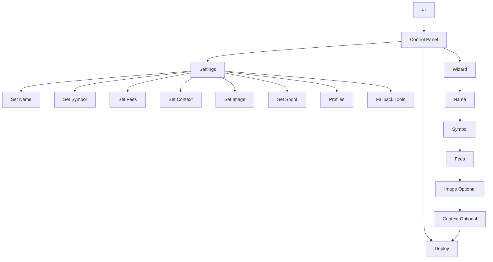

# Clank & Claw v2.7.0

Production-grade token deployment suite for Base using Clanker SDK.

Deploy entry points:
- Telegram bot (`telegram-bot.js`)
- CLI (`deploy.js`)
- OpenClaw handler (`openclaw-handler.js`)

All entry points share one canonical pipeline:
1. Config builder (`lib/config.js`)
2. Smart validator (`lib/validator.js`)
3. On-chain deploy engine (`clanker-core.js`)

## Documentation Map

Start here based on your role:
- Operator runbook (visual flow + troubleshooting): `docs/VISUAL_FLOW_RUNBOOK.md`
- VPS install + repair SOP (copy-paste): `docs/VPS_INSTALL_REPAIR_SOP.md`
- System architecture (component-level): `docs/SYSTEM_ARCHITECTURE.md`
- Token config reference (`token.json`): `TOKEN_CONFIG_GUIDE.md`
- Release history: `RELEASES.md`

## Visual Overview


## Core Behavior

### Smart Logic (default ON)

`SMART_VALIDATION=true` enables auto-heal behavior:
- Missing/invalid image -> fallback image
- Missing context -> derive from URL, else default/synthetic context
- Invalid socials -> normalize or drop
- Broken rewards split -> rebalance to `10000 bps`
- Invalid strict-mode requirements -> auto-relax to standard mode

Notes:
- `token.json` runs strict manual mode (no auto-correct for core fields).
- `token.json` accepts human-friendly syntax (`//` comments, trailing commas) and flat aliases (`fee`, `contextUrl`, top-level socials).
- `token.json` supports `fees.mode = static | dynamic` with explicit parameters.
- For social context (`twitter`/`farcaster`), set `context.id` to the real social account id for better clanker.world matching.
- Preflight output includes smart-fix summary.

### Input Policy

The bot now allows broad free-form input and relies on validator auto-heal.

Operational effect:
- Name/symbol can be empty or whitespace from chat input.
- Deploy remains possible because validator generates safe fallback when needed.

## Quick Start

### 1) Install

```bash
git clone https://github.com/Timcuan/clank-and-claw.git
cd clank-and-claw
npm install
```

### 2) Configure

```bash
cp .env.vps.example .env
npm run setup
```

### 3) Run

Telegram bot:
```bash
npm run start
```

CLI deploy (`token.json`):
```bash
npm run deploy
```

Deploy and require clanker.world indexing confirmation:
```bash
node deploy.js --require-index --index-timeout 300
```

Dry-run deploy:
```bash
npm test
```

Hardening suite:
```bash
npm run test:hardening
```

CI/local full test suite:
```bash
npm run test:ci
```

Fast token.json validation (no deploy):
```bash
npm run token:check
```

## VPS Production Workflow

Full install and repair SOP:
- `docs/VPS_INSTALL_REPAIR_SOP.md`

Bootstrap the VPS first (required before using `~/clawctl`):

```bash
curl -fsSL https://raw.githubusercontent.com/Timcuan/clank-and-claw/main/vps-setup.sh | bash
```

Recommended VPS flow (PM2 + single instance) after bootstrap:

```bash
~/clawctl kubo-install
~/bot-setup.sh
~/clawctl doctor
~/bot-start.sh
~/bot-status.sh
pm2 logs clanker-bot
```

All-in-one manager:

```bash
~/clawctl wizard
```

Direct manager commands:

```bash
~/clawctl doctor
~/clawctl kubo-install
~/clawctl kubo-status
~/clawctl kubo-restart
~/clawctl telegram-setup
~/clawctl ipfs-setup
~/clawctl start
~/clawctl status
~/clawctl update
~/clawctl heal
~/clawctl backup
~/clawctl uninstall
~/clawctl shortcuts
```

Kubo lifecycle quick helpers:

```bash
~/kubo-setup.sh
~/kubo-status.sh
~/kubo-start.sh
~/kubo-stop.sh
~/kubo-restart.sh
```

Important notes:
- Run bootstrap as the operational VPS user (avoid staying on a permanent root shell), or use the exact user that will run the bot.
- If helper commands are missing after setup, run:
```bash
bash ~/clank-and-claw/vps-manager.sh shortcuts
```
- If setup was previously run as root and permissions are broken:
```bash
sudo chown -R "$USER:$USER" ~/clank-and-claw
```

## Telegram Command Surface

Recommended command:
- `/a` open button-first control panel

Other commands:
- `/deploy` start guided wizard
- `/go <SYMBOL> "<NAME>" <FEES>` quick setup
- `/spoof <ADDRESS>` enable spoof
- `/spoof off` disable spoof
- `/profiles` manage saved config presets
- `/save <name>` save current config preset
- `/load <name>` load saved preset
- `/deletepreset <name>` delete preset
- `/status` wallet/runtime check
- `/health` deep health checks (Telegram origins + RPC endpoints)
- `/cancel` reset session

## Telegram Flow Summary



Detailed state-by-state flow: `docs/VISUAL_FLOW_RUNBOOK.md`

## Recommended `.env` Baseline

```env
RPC_URL=https://mainnet.base.org
RPC_FALLBACK_URLS=https://base-mainnet.g.alchemy.com/v2/<KEY>,https://base.publicnode.com,https://base.llamarpc.com

TELEGRAM_API_BASES=https://api.telegram.org
IPFS_GATEWAYS=https://gateway.pinata.cloud/ipfs/{cid},https://nftstorage.link/ipfs/{cid},https://cloudflare-ipfs.com/ipfs/{cid}

SMART_VALIDATION=true
VANITY=true
REQUIRE_CONTEXT=true
DEFAULT_CONTEXT_ID=<valid_post_or_cast_id>
DEFAULT_IMAGE_URL=
```

## IPFS Upload Backend (Telegram Image -> CID)

Configure at least one upload backend:
Runtime priority is fixed: **Local Kubo -> Pinata -> legacy providers**.

Install/repair local Kubo daemon:
```bash
~/clawctl kubo-install
~/clawctl kubo-status
```

1. Local Kubo node (no API key, recommended self-hosted):
```env
IPFS_KUBO_API=http://127.0.0.1:5001
```

2. Pinata (recommended hosted):
```env
PINATA_API_KEY=...
PINATA_SECRET_KEY=...
```

Legacy backends (disabled by default, enable explicitly):
```env
INFURA_PROJECT_ID=...
INFURA_SECRET=...
ENABLE_INFURA_IPFS_LEGACY=true

NFT_STORAGE_TOKEN=...
ENABLE_NFT_STORAGE_CLASSIC=true
```

Interactive setup on VPS:
```bash
~/clawctl ipfs-setup
```

## Persistent Config Store (Built-in Local DB)

Telegram bot now stores:
- Auto-saved draft per chat (survives restart)
- Named presets per chat (`/save`, `/load`, `/deletepreset`)

Default file path:
```env
CONFIG_STORE_PATH=./data/bot-config-store.json
```

No external database is required for single-instance VPS operation.
For multi-instance/HA deployment, move to shared storage (e.g. PostgreSQL/Redis) in a later phase.

## Common Incidents

### Invalid bot token (`Unauthorized`)

1. `~/clawctl telegram-setup`
2. `~/clawctl doctor`
3. `~/clawctl start`
4. `pm2 logs clanker-bot`

Do not keep placeholder token values in `.env`.

### `getUpdates` conflict (multiple instances)

1. `~/clawctl status`
2. `~/clawctl stop`
3. `~/clawctl heal`
4. `~/clawctl start`

### RPC instability

1. `~/clawctl doctor`
2. `~/clawctl netcheck`
3. Add/verify `RPC_FALLBACK_URLS`
4. Restart bot

### Image upload fails / CID not generated

1. `~/clawctl ipfs-setup`
2. `~/clawctl doctor` (must show active IPFS upload backend)
3. If using local Kubo, run `~/clawctl kubo-status` (now includes recent service logs).
4. If `IPFS_KUBO_API` still unreachable, run `~/clawctl kubo-install --force`.
5. Retry sending image in `/a -> Settings -> Image`.

## Project Map

```text
clank-and-claw/
├── vps-manager.sh
├── vps-setup.sh
├── telegram-bot.js
├── deploy.js
├── openclaw-handler.js
├── clanker-core.js
├── lib/
│   ├── config.js
│   ├── validator.js
│   ├── parser.js
│   ├── social-parser.js
│   ├── ipfs.js
│   ├── telegram-network.js
│   └── session-manager.js
├── docs/
│   ├── VISUAL_FLOW_RUNBOOK.md
│   └── SYSTEM_ARCHITECTURE.md
├── test/
└── token.json
```

## Operational Notes

- Only run one bot instance per token to avoid Telegram polling conflicts.
- Bot uses local lock file and conflict backoff to reduce duplicate runner issues.
- PM2 startup failures due to fatal config (e.g. invalid token) are treated as hard errors.
- `DRY_RUN=true` validates and simulates deploy without gas spend.
