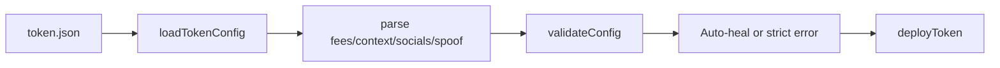
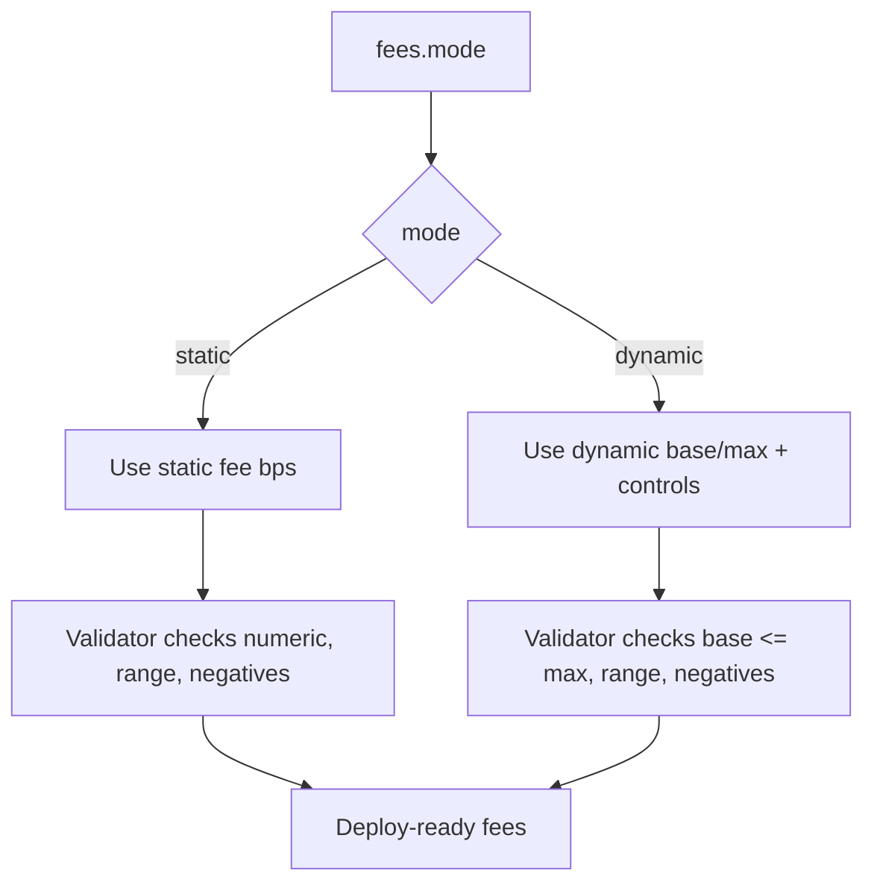
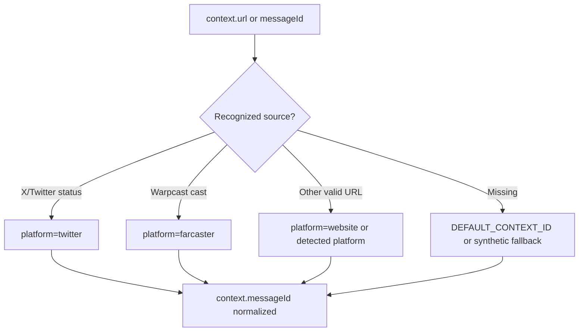
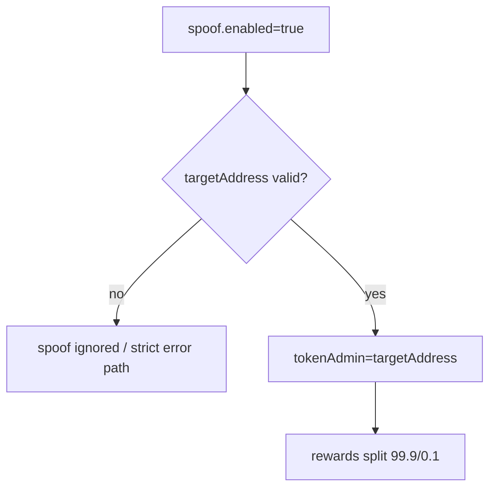

# Token Config Guide (`token.json`)

This guide focuses on `token.json` structure, field behavior, and how each field moves through validation to deployment.

For operator runtime flow on VPS and Telegram, see `docs/VISUAL_FLOW_RUNBOOK.md`.

## 1. Token Config Processing Flow



## 2. Minimal Example

```json
{
  "name": "My Token",
  "symbol": "TOKEN",
  "image": "bafkreiabcd1234",
  "fees": {
    "mode": "static",
    "static": {
      "clankerFeeBps": 300,
      "pairedFeeBps": 300
    }
  },
  "context": {
    "url": "https://x.com/user/status/123456789"
  }
}
```

## 3. Full Example

```json
{
  "name": "Moon Token",
  "symbol": "MOON",
  "image": "bafkreixyz123",
  "description": "To the moon",
  "fees": {
    "mode": "dynamic",
    "dynamic": {
      "baseFeePercent": 1,
      "maxFeePercent": 10,
      "adjustmentPeriod": 3600,
      "resetPeriod": 86400,
      "resetTickFilter": 100,
      "feeControlNumerator": 100000,
      "decayFilterBps": 9500
    }
  },
  "context": {
    "url": "https://github.com/org/repo"
  },
  "socials": {
    "x": "https://x.com/moontoken",
    "telegram": "https://t.me/moontoken",
    "website": "https://moontoken.com"
  },
  "spoof": {
    "enabled": false
  },
  "advanced": {
    "devBuy": 0.01,
    "vanity": true,
    "strictMode": false,
    "smartValidation": false
  }
}
```

## 4. Field-by-Field Reference

| Field | Type | Required | Behavior |
|---|---|---|---|
| `name` | string | no | Empty allowed; validator can fallback |
| `symbol` | string | no | Empty allowed; validator can fallback |
| `image` | URL/CID | recommended | Invalid/missing can fallback in smart mode |
| `description` | string | no | Used for metadata description |
| `fees.mode` | `static` or `dynamic` | yes | selects fee model |
| `fees.static` | object | if static | static BPS inputs |
| `fees.dynamic` | object | if dynamic | dynamic fee parameters |
| `context.url` | URL | recommended | auto-fetch messageId/platform |
| `context.platform` | string | no | optional override |
| `socials` | object | no | normalized into metadata links |
| `spoof` | object | no | controls reward split and tokenAdmin |
| `antiBot` | object | no | enables sniper fees |
| `advanced.devBuy` | number | no | auto dev buy ETH amount |
| `advanced.smartValidation` | bool | no | strict or auto-heal policy |

## 5. Fees Model (Visual)



### 5.1 Static Mode

```json
{
  "fees": {
    "mode": "static",
    "static": {
      "clankerFeeBps": 300,
      "pairedFeeBps": 300
    }
  }
}
```

### 5.2 Dynamic Mode

```json
{
  "fees": {
    "mode": "dynamic",
    "dynamic": {
      "baseFeePercent": 1,
      "maxFeePercent": 10,
      "adjustmentPeriod": 3600,
      "resetPeriod": 86400
    }
  }
}
```

Defaults when dynamic values are missing:
- `baseFee`: 1% (100 bps)
- `maxFee`: 10% (1000 bps)

## 6. Context Auto-Fetch Behavior



Supported platform auto-detection examples:
- `https://x.com/...` -> `twitter`
- `https://warpcast.com/...` -> `farcaster`
- `https://github.com/...` -> `github`
- `https://t.me/...` -> `telegram`
- Any other HTTPS -> `website`

## 7. Spoof Mode Flow



Example:

```json
{
  "spoof": {
    "enabled": true,
    "ourWallet": "0xYourRealWallet",
    "targetAddress": "0xAddressThatAppearsAsDeployer"
  }
}
```

## 8. Smart Validation Policy

| Mode | Behavior |
|---|---|
| `advanced.smartValidation: false` | strict mode for manual editing; invalid fields can throw |
| `advanced.smartValidation: true` | auto-heal mode; attempts to fix malformed input |

Recommended:
- Manual, high-control workflow: keep `false`
- Automation, bot-heavy workflow: set `true`

## 9. Legacy Fee Inputs (Still Supported)

| Input | Parsed Result |
|---|---|
| `"6%"` | 3% + 3% |
| `"3% 3%"` | 3% + 3% |
| `"600bps"` | 3% + 3% |
| `"300 300"` | 3% + 3% |

## 10. Common Mistakes and Fixes

| Mistake | Result | Fix |
|---|---|---|
| `fees.mode` missing | fallback static behavior | set explicit `static` or `dynamic` |
| invalid image ref | fallback image or strict error | set valid HTTP URL/CID |
| empty context + strict policy | can fail | provide `context.url` |
| malformed socials | normalized/dropped | use full HTTPS links |
| unrealistic dynamic values | clamped/aligned | set sane base/max values |

## 11. Validation Commands

Before real deployment:

```bash
npm run test:hardening
npm test
```

For Telegram runtime:

```bash
/a
```

For VPS runtime gate:

```bash
~/clawctl doctor
```

