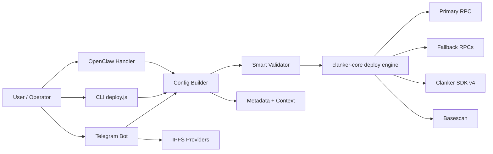
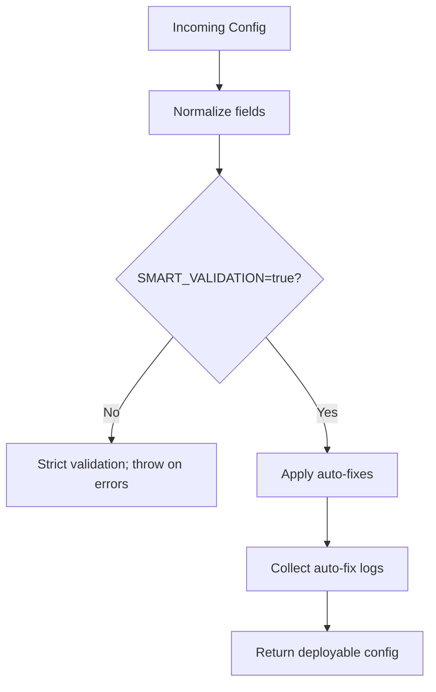
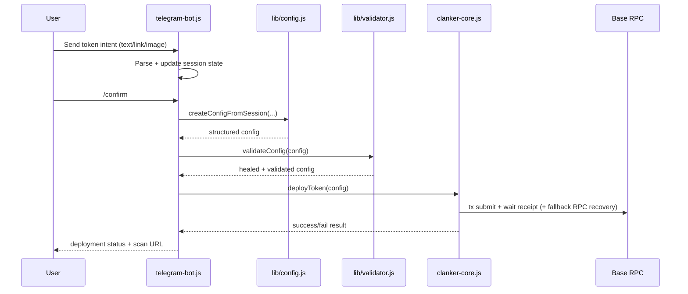
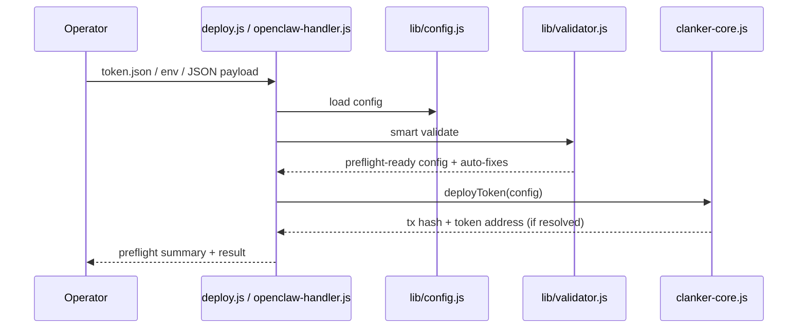

# System Architecture - Clank & Claw

This document explains how the platform works end-to-end, including smart validation logic, deployment paths, and failure recovery behavior.

## 1. High-Level Architecture



## 2. Deployment Entry Points

- Telegram bot: conversational agent, session-based, multi-user safe.
- CLI (`deploy.js`): deterministic file/env deployment path with preflight.
- OpenClaw (`openclaw-handler.js`): JSON input gateway for AI/automation tools.

All entry points converge into the same 3-stage pipeline:

1. Build config (`lib/config.js`)
2. Smart validation + auto-heal (`lib/validator.js`)
3. Chain deploy (`clanker-core.js`)

## 3. Smart Validation & Auto-Heal

Smart mode is enabled by default (`SMART_VALIDATION=true`).

### Auto-heal matrix

| Area | If user input is incomplete/invalid | System behavior |
|---|---|---|
| Name/Symbol | Missing or malformed | Generate safe fallback and normalize |
| Image | Missing/invalid URL/CID | Apply fallback image (`DEFAULT_IMAGE_URL` or default CID gateway) |
| Fees | Too high / invalid format | Clamp/reset to protocol-safe fee (max 6%) for env/bot; token.json custom mode can bypass cap |
| Context | Missing message ID/platform | Auto-derive from source URL, else use `DEFAULT_CONTEXT_ID`, else synthetic context |
| Social URLs | Bare/partial URLs | Normalize to valid `https://...` or drop invalid entries |
| Rewards | Invalid bps/admin/recipient | Drop broken recipients and rebalance to 10000 bps |
| Strict mode | Requirements incomplete | Auto-relax to standard mode (deploy continues) |

### Validation decision flow



## 4. Telegram Bot Runtime Flow



## 5. CLI/OpenClaw Runtime Flow



## 6. Network Resilience Model

- Primary + fallback RPC probing before deployment.
- Receipt recovery if primary RPC times out after tx submission.
- Telegram API origin failover (`TELEGRAM_API_BASES`).
- Retry policy differentiates transient vs permanent Telegram API failures.
- IPFS provider/gateway fallback for media handling.

## 7. Required Runtime Guarantees

- Deploy process should not fail for common user input mistakes.
- All deploy paths share one canonical validator.
- Preflight exposes smart-fix summary for observability.
- Session isolation prevents cross-chat state pollution.

## 8. Recommended Production Baseline

```env
SMART_VALIDATION=true
VANITY=true
REQUIRE_CONTEXT=true
DEFAULT_CONTEXT_ID=<valid_post_or_cast_id>
RPC_URL=https://mainnet.base.org
RPC_FALLBACK_URLS=<rpc1>,<rpc2>,<rpc3>
TELEGRAM_API_BASES=https://api.telegram.org
```

This baseline keeps deployments flexible while preserving indexing quality and runtime reliability.
