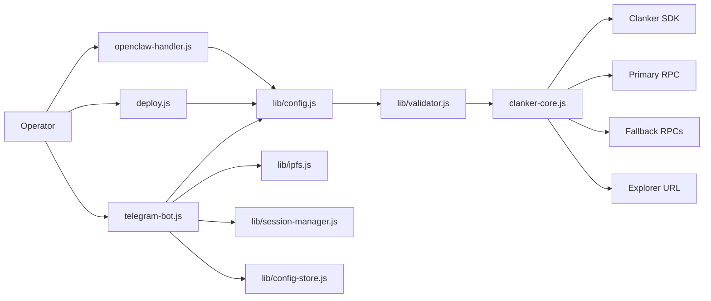
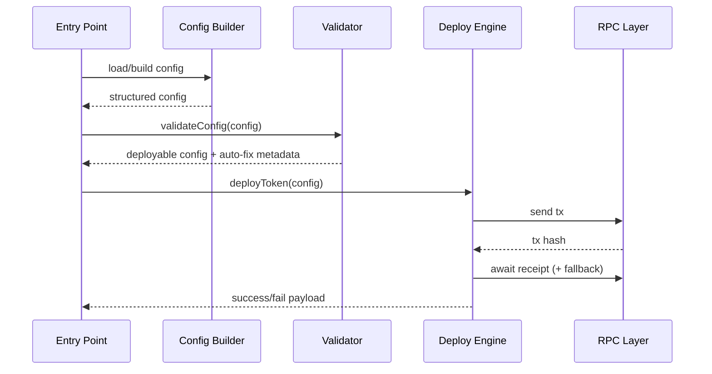
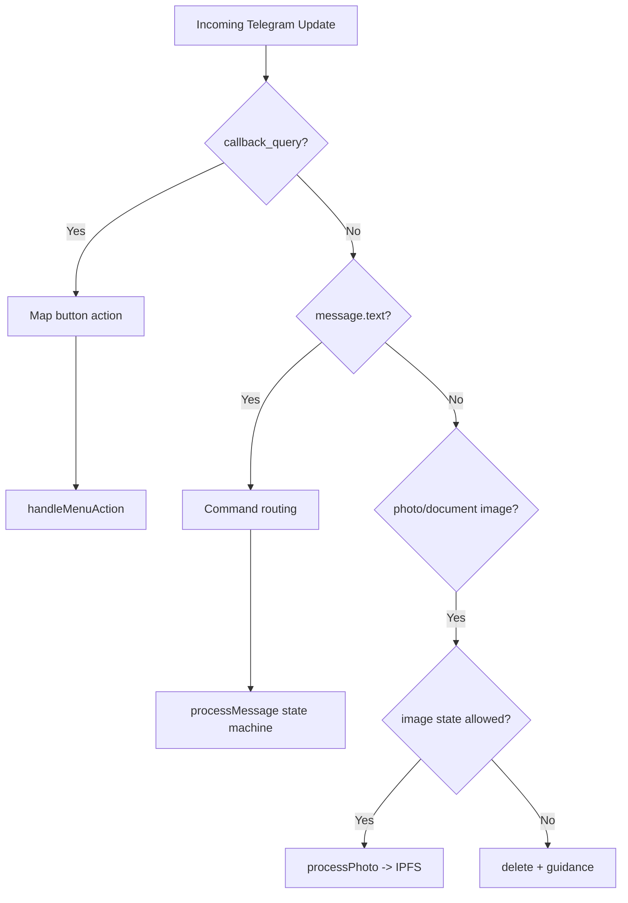
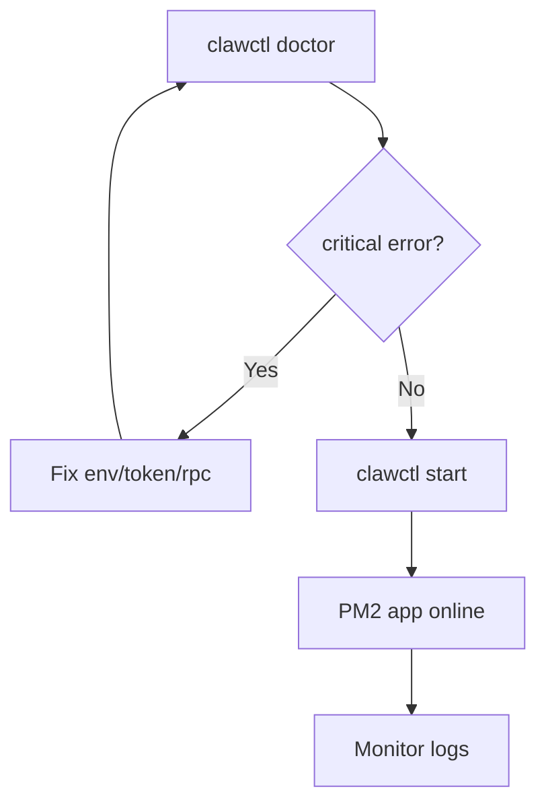

# System Architecture - Clank & Claw

This document explains internals of the deployment stack and how runtime behavior is enforced.

If you need operator steps and troubleshooting, use `docs/VISUAL_FLOW_RUNBOOK.md`.

## 1. Architecture at a Glance



## 2. Canonical Deployment Pipeline

All entry points converge into one deterministic sequence:

1. Build config object.
2. Normalize and validate config.
3. Submit tx through deploy engine.
4. Recover receipt with fallback RPC when needed.
5. Return unified result object.



## 3. Entry Point Contracts

### Telegram (`telegram-bot.js`)
- Stateful conversational interface per chat.
- Button-first control panel (`/a`).
- Image input guarded by explicit states only.
- Builds config from session using `createConfigFromSession`.

### CLI (`deploy.js`)
- Deterministic config path from `.env` or `token.json`.
- Preflight and dry-run path for safety.

### OpenClaw (`openclaw-handler.js`)
- JSON input gateway for automation/agents.
- Input mapping to env-compatible deploy schema.
- Returns machine-readable JSON result.

## 4. Validator Responsibilities

Validator (`lib/validator.js`) is the guardrail boundary before on-chain calls.

### Core responsibilities
- Normalize metadata and context.
- Validate static/dynamic fees.
- Normalize or drop malformed social URLs.
- Validate rewards recipients and rebalance BPS.
- Enforce strict-mode constraints or auto-relax in smart mode.

### Auto-heal behavior in smart mode

| Domain | Detection | Action |
|---|---|---|
| Name/Symbol | empty/invalid | generate fallback values |
| Image | invalid URL/CID | set fallback image |
| Static fees | invalid/negative/too high | normalize and cap/reset |
| Dynamic fees | invalid range | clamp and align base/max |
| Context | missing | derive URL or fallback context |
| Rewards | invalid recipients/bps | drop/rebalance to 10000 |

## 5. Telegram Runtime Model

### State categories
- Panel input states: `menu_*`
- Wizard states: `wizard_*`
- Session states: `idle`, `collecting`, `confirming`

### Media safety
- Accepted only when state is `menu_image` or `wizard_image`.
- Outside those states, image message is deleted when possible and user is redirected to proper flow.

### Control routing



## 6. Reliability and Failover Layers

### RPC resilience
- Primary RPC first.
- Fallback RPC list for retries/recovery.
- Receipt recovery for late confirmations.

### Telegram resilience
- Supports multiple Telegram API bases.
- Retry policy for transient errors.
- Distinguishes retryable and permanent failures.
- Conflict backoff for duplicate polling instances.

### Process resilience
- Local lock file to block duplicate local bot run.
- PM2 as recommended process supervisor on VPS.
- `vps-manager.sh heal` for webhook/lock/process cleanup.

## 7. VPS Management Architecture

`vps-manager.sh` provides operational lifecycle commands:
- `doctor`: preflight health gate
- `telegram-setup` / `ipfs-setup`: guided credential/backend setup
- `start/stop/restart/status/logs`
- `update`: git pull + deps + tests + restart
- `heal`: recover from lock/process/webhook conflicts
- `backup/restore/uninstall`



## 8. Data and Config Sources

Priority model by entry point:

- Telegram: chat session -> `createConfigFromSession`
- CLI: `token.json` (or env path) -> `loadTokenConfig` / `loadConfig`
- OpenClaw: JSON payload -> env mapping -> `loadConfig`

Shared output target:
- Unified config object accepted by validator and deploy engine.

## 9. Security and Safety Guardrails

- Invalid wallet key blocks deploy.
- Placeholder Telegram token blocks bot startup in manager flow.
- Uninstall includes path safety checks to avoid unsafe directory removal.
- Session isolation avoids cross-chat state leakage.

## 10. Recommended Production Baseline

```env
SMART_VALIDATION=true
REQUIRE_CONTEXT=true
VANITY=true
RPC_URL=https://mainnet.base.org
RPC_FALLBACK_URLS=<rpc1>,<rpc2>,<rpc3>
TELEGRAM_API_BASES=https://api.telegram.org
IPFS_GATEWAYS=<gateway1>,<gateway2>
```

## 11. Cross-Reference

- Operator flow and runbook: `docs/VISUAL_FLOW_RUNBOOK.md`
- Token parameter reference: `TOKEN_CONFIG_GUIDE.md`
- Release timeline: `RELEASES.md`
