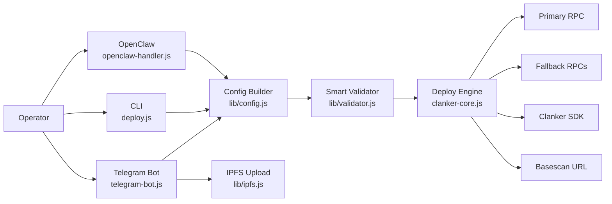
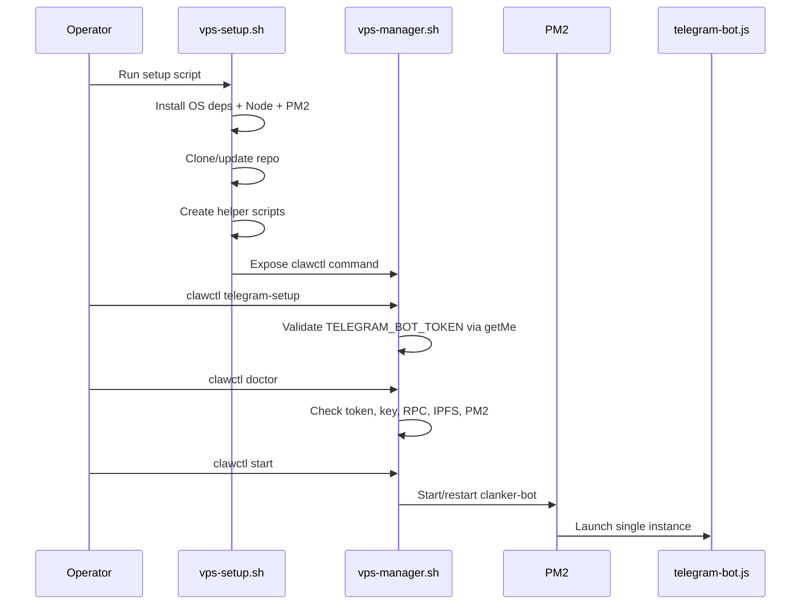
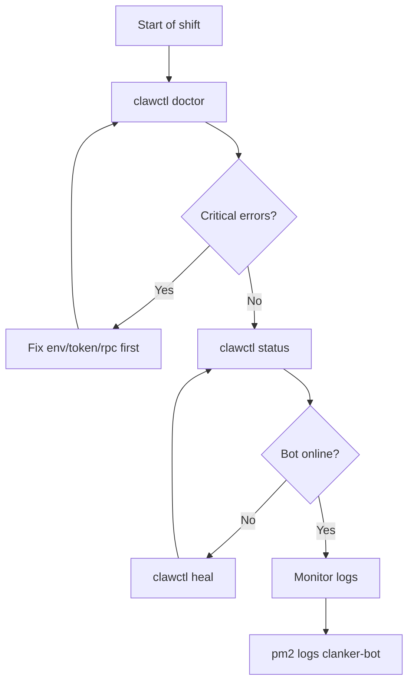
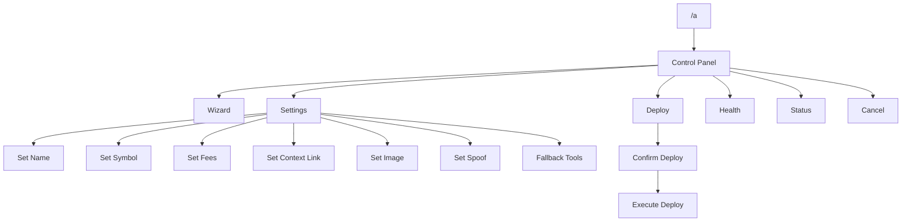
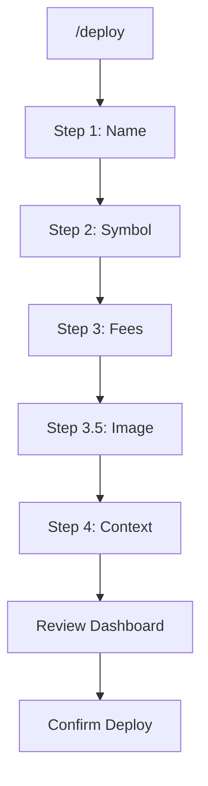
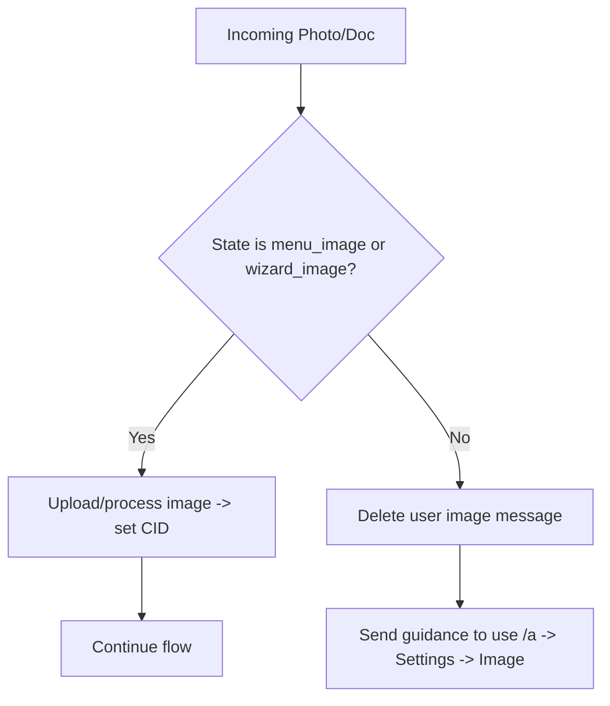
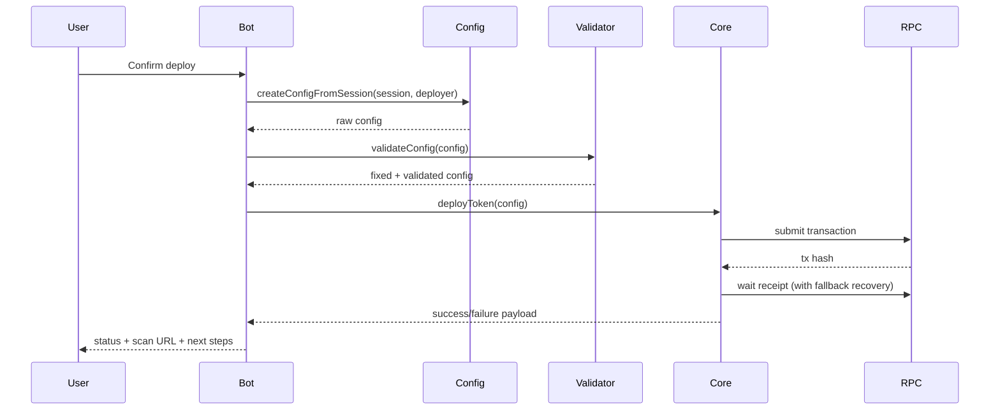

# Clank & Claw Visual Flow Runbook

This runbook is an operator-facing visual guide for day-to-day execution on VPS and Telegram.

Use this document when you need to:
- Understand exact runtime flow before deploying.
- Onboard new operators without guesswork.
- Troubleshoot deployment or Telegram bot errors quickly.

## 1. System Topology (Single Source of Truth)

## 2. Fresh VPS Setup Flow

## 3. Production Operations Map

## 4. Telegram UX Flow (Button-First)

### 4.1 Main menu flow

### 4.2 Wizard flow

## 5. Telegram State Machine (Exact Runtime States)

| State | Expected Input | Transition | Notes |
|---|---|---|---|
| `idle` | free text/links/commands | `collecting` or panel actions | session default |
| `collecting` | free text/links/commands | parsing/fallback/deploy review | accepts natural language |
| `menu_name` | any text | `collecting` | can be empty/spaces |
| `menu_symbol` | any text | `collecting` | can be empty/spaces |
| `menu_fees` | fee text (`6%`, `600bps`, `3% 3%`) | `collecting` | invalid input prompts retry |
| `menu_context` | URL | `collecting` | platform auto-detected |
| `menu_image` | photo/URL/CID | `collecting` | only state where manual image input is valid |
| `menu_spoof` | `0x...` or `off` | `collecting` | toggles spoof mode |
| `wizard_name` | any text | `wizard_symbol` | guided flow |
| `wizard_symbol` | any text | `wizard_fees` | guided flow |
| `wizard_fees` | preset/button/custom text | `wizard_image` | default can be 6% |
| `wizard_image` | photo/URL/CID or skip | `wizard_context` | image optional |
| `wizard_context` | URL or skip | `collecting` | context optional |
| `confirming` | confirm/cancel | deploy or reset | deploy lock active |

## 6. Media Input Safety Rules

Behavior summary:
- Image is accepted only in `menu_image` and `wizard_image`.
- Any image outside those states is auto-deleted when possible.
- User gets explicit guidance to open proper image setting flow.

## 7. Deployment Pipeline (Detailed)

## 8. Smart Validation Auto-Heal Matrix

| Area | Typical bad input | Auto-heal result |
|---|---|---|
| Name/Symbol | empty/whitespace | fallback generated |
| Image | missing/invalid | fallback image applied |
| Static fees | invalid/negative | normalized to safe defaults |
| Dynamic fees | invalid/inverted range | clamped/aligned values |
| Context | missing or malformed | derive from URL, then fallback ID, then synthetic |
| Social links | malformed URLs | normalized or dropped |
| Rewards | invalid bps/admin/recipient | dropped/rebalanced to 10000 bps |
| Strict mode | requirement not complete | auto-relax to standard mode |

## 9. Error Recovery Playbook

### 9.1 Invalid bot token (`Unauthorized`)

1. Run `~/clawctl telegram-setup` and paste valid token from `@BotFather`.
2. Run `~/clawctl doctor`.
3. Run `~/clawctl start`.
4. Verify with `~/clawctl status` and `pm2 logs clanker-bot`.

### 9.2 getUpdates conflict (multiple instances)

1. Run `~/clawctl status`.
2. Stop old/direct process via `~/clawctl stop`.
3. Run `~/clawctl heal` to clean stale lock and webhook.
4. Start once via `~/clawctl start`.

### 9.3 RPC/network instability

1. Run `~/clawctl doctor`.
2. Run `~/clawctl netcheck`.
3. Set multiple `RPC_FALLBACK_URLS` in `.env`.
4. Restart bot and re-check logs.

## 10. VPS Command Reference

| Goal | Command |
|---|---|
| Interactive all-in-one menu | `~/clawctl wizard` |
| Full preflight diagnostic | `~/clawctl doctor` |
| Setup Telegram token/admin | `~/clawctl telegram-setup` |
| Start bot | `~/clawctl start` |
| Stop bot | `~/clawctl stop` |
| Restart bot | `~/clawctl restart` |
| Self-heal lock/webhook/process | `~/clawctl heal` |
| Health status | `~/clawctl status` |
| Tail logs | `~/clawctl logs 120` |
| Safe update (git + npm + tests + restart) | `~/clawctl update` |
| Backup | `~/clawctl backup` |
| Restore | `~/clawctl restore <backup.tar.gz>` |
| Clean uninstall | `~/clawctl uninstall` |

## 11. Recommended Pre-Deploy Checklist

1. `~/clawctl doctor` returns no critical errors.
2. `.env` has valid `TELEGRAM_BOT_TOKEN` and `PRIVATE_KEY`.
3. `RPC_URL` and at least one fallback RPC are reachable.
4. `SMART_VALIDATION` and context policy match your deployment style.
5. Bot runs as single PM2 instance only.

## 12. Post-Deploy Checklist

1. Verify success message in Telegram includes scan link.
2. Confirm tx hash on Base explorer.
3. Confirm token address if returned by deploy result.
4. Keep logs for incident review if deployment took fallback path.
